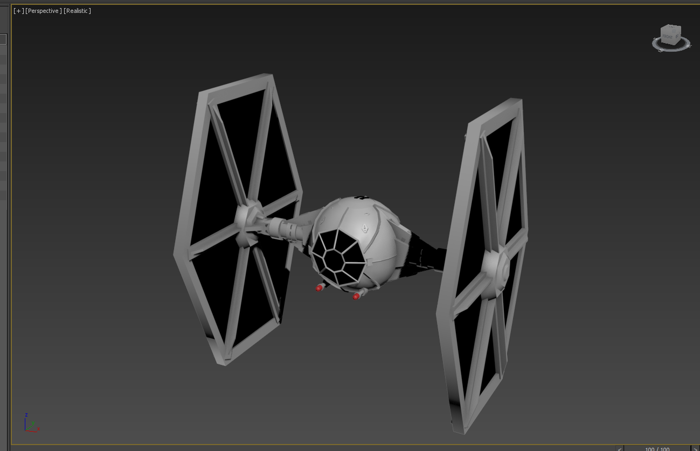
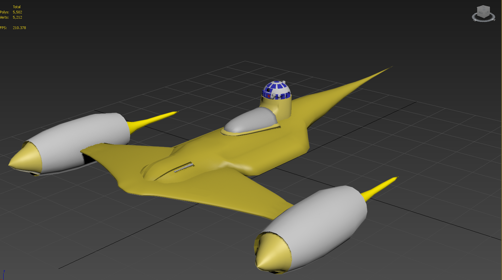
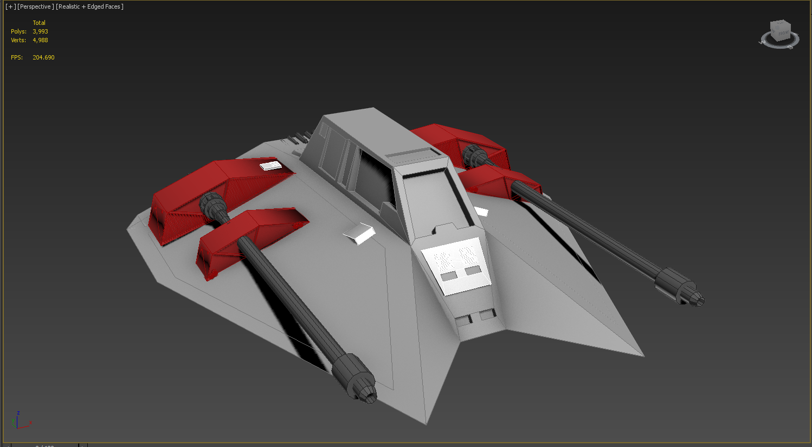
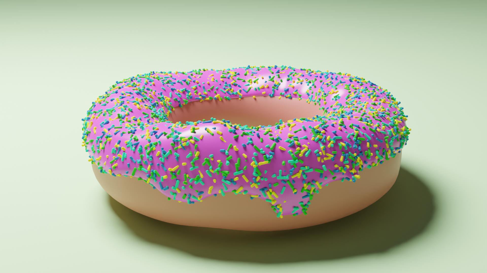
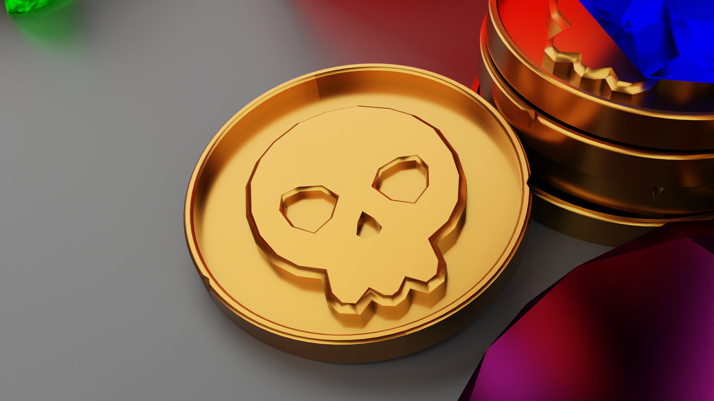
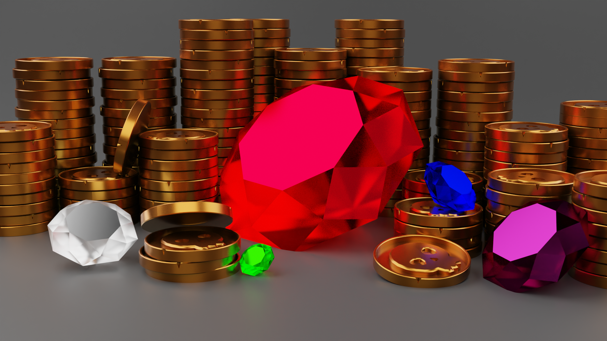
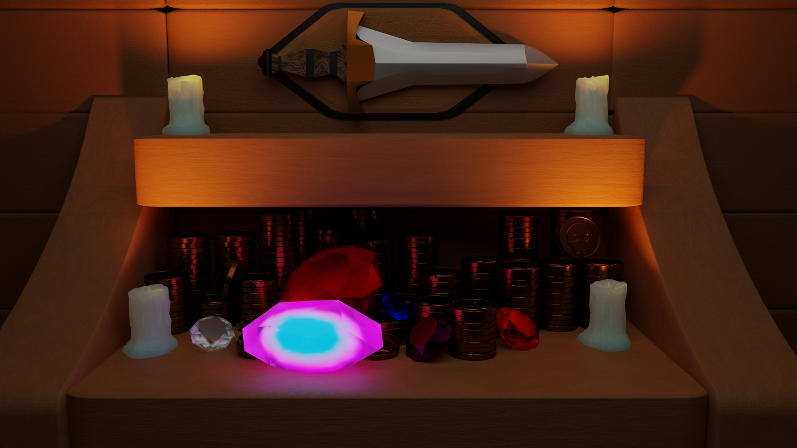
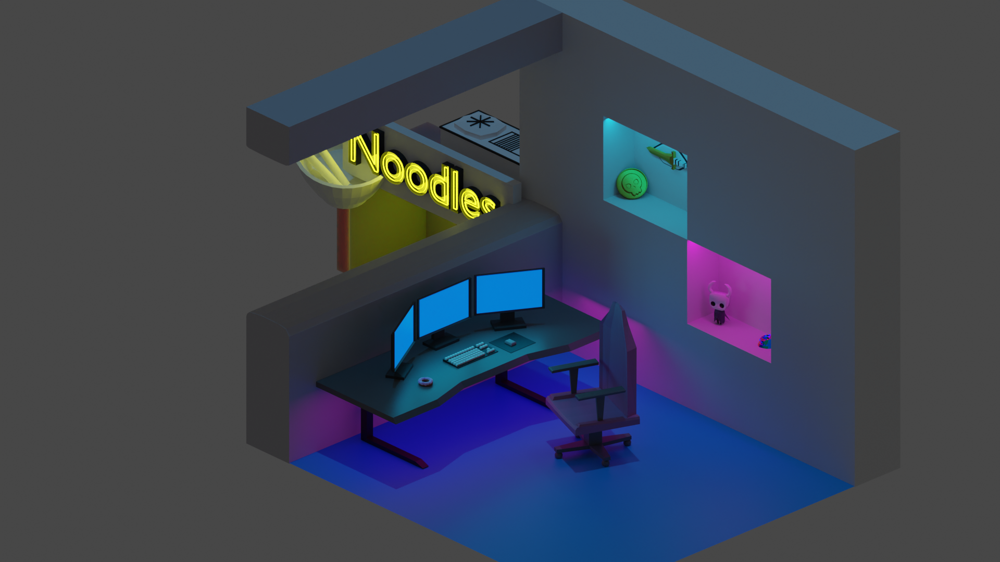

---
title: 3D modelling
lead: My adventures into the lands of modelling
published: 2025-10-14
tags: [ Personal, Blender, 3DS Max ]
---

# The beginnings
The first time I ever touched a piece of 3D modelling software was in university. It was AutoDesk's 3DS Max and as part of my course I had to choose and model some entities from Star Wars and put it into an animation.

It was very different to anything that I had done before.

After rewatching the 6 Star Wars films which were out at the time (for research purposes, of course!) I decided to model 3 things: 
- The TIE Fighter (A classic Star Wars ship, needs no introduction whatsoever)
- A N1 Starfighter (The ship that Luke Skywalker flew in Episode 4)
- A Snowspeeder (The ship used in the Battle of Hoth in Episode 5)

I spent weeks modelling these ships, learning the software as I went along. It was a steep learning curve but I was (and still am) pretty proud of how it turned out in the end! 
Here are the final renders of these models: 

A more in-depth blog I kept during making these can be found [here](https://arusstarwarsmodellingproject.blogspot.com/)

# The new age of Blender

I didn't really touch 3D modelling again until a few years later when I decided to try and model something just for fun using Blender instead. Mainly for monetary reasons, I didn't want to pay for 3DS Max and I'd heard people raving about Blender anyway.
Given the time it had been since I last did any modelling, I was looking straight to Google to see what the best thing to introduce me to the Blender was and I found the go to tutorial. 

The Blender Guru's Donut tutorial. Here's mine!

This really helped me get around Blender learnig more of the keybinds etc to help me get started. 
From here I wanted to start having an idea and then just going at it myself instead of following tutorials. 

So I decided to try and model a pirate coin. A simple concept which can be as in-depth as I choose. and I ended up with this: 

This is where the concept started to take shape so naturally it evolved into a trove of treasure instead of just a single thing: 

And then a whole taking, sitting on a ship etc. Where I started to experiment with lighting and glowing objects which could be like mysterious artifacts.

I kept building it up until I eventually decided that I wanted to switch it up. I think around that time Cyberpunk had been out for a little while and I thought about designing a Cyberpunk style, isometric room. 

The eagle eyed proably noticed the trinkets on the shelves are other things I'd worked on in Blender, I thought it was incredible to just import them and have them look so naturally fitting. 
I also did very much enjoy Hollow Knight, so much so I modelled them!

It's incredible seeing how I just had an idea and completely _ran_ with it.

More to come soon™️