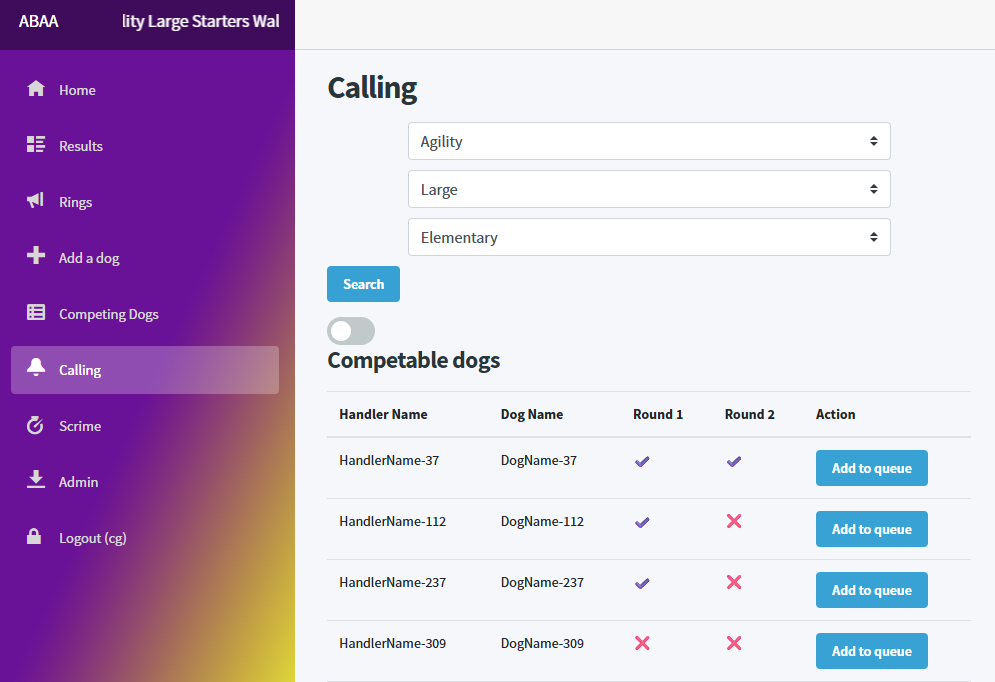
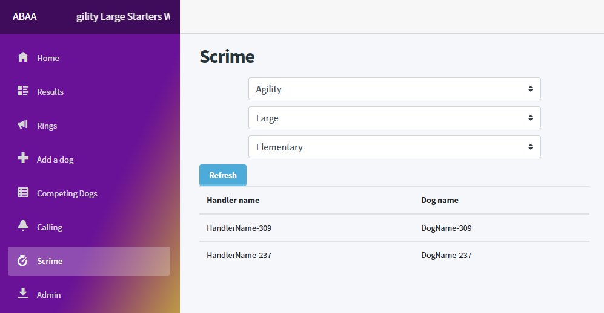
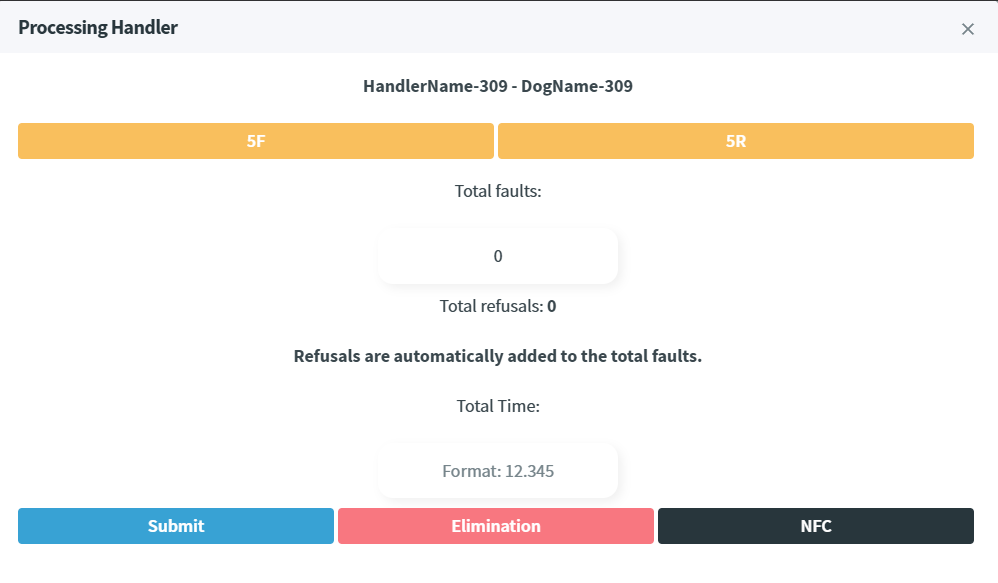
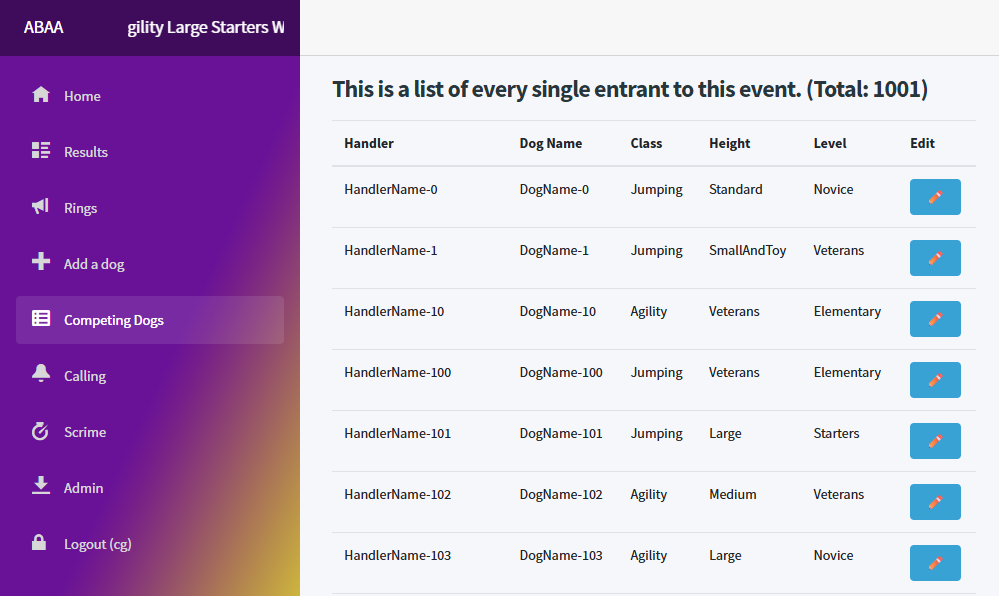
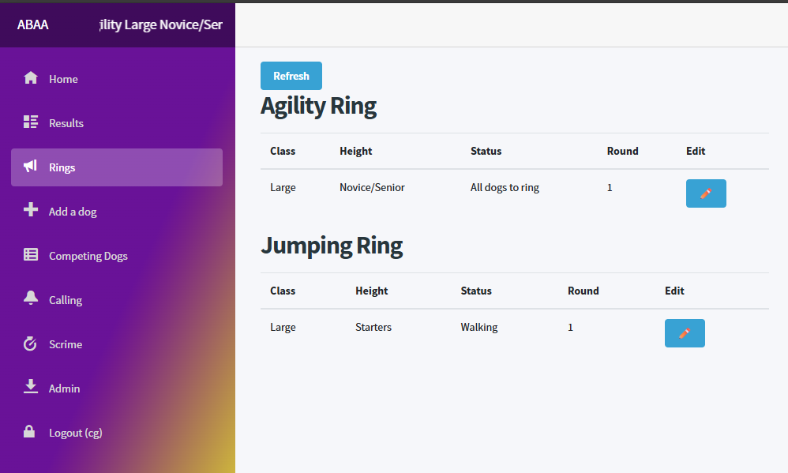
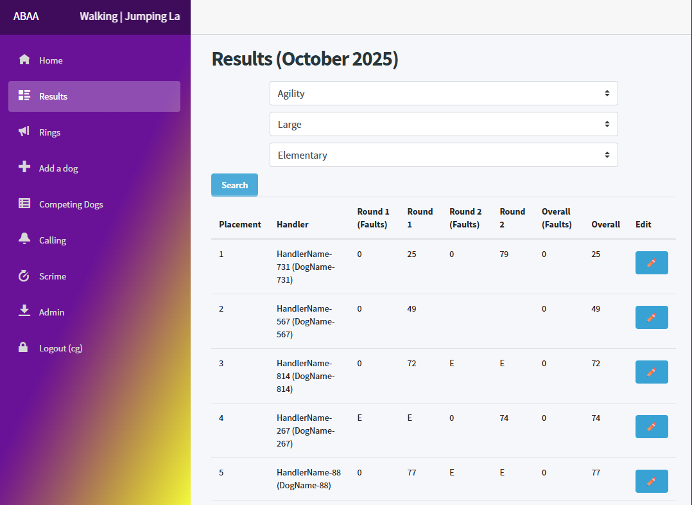

### Full disclaimer: I am **not** a frontend developer and fighting pixels is not one of my best skills, so expect some minor imperfections!
This page itself is quite agility racing heavy too, I didn't know any of this before starting so I'd skip to the screenshots if you're just interested in the actual website.

# About the website
The website was made bespoke for the club itself, they do things different to other clubs and their website needed to reflect that.
Additionally, the project is ever evolving, with usually there being a couple of updates/tweaks or quality of life improvements since they host their shows in the winter.

## What is dog agility?
Dog Agility is where handlers (ie people) will run their beloved pet around a course, having them jump over hurdles, dash through weaves and zoom through tunnels.

## Alright, so what's ABAA?
ABAA, not to be confused with a fantastic band of the same name, stands for Absolutely Barking Agility Addicts. Which is a club that host their own dog agility events. 

## Sounds simple enough, so what does it do?
It's got a couple of different mechanisms, all related to management and tracking of the event itself. I've labelled each page with who would be able to access it: 
The quick rundown is that it's got 5 main features: 
- Calling
- Scriming
- Dog management
- Ring management 
- Result viewing

## What about the more backend stuff which users don't see?
The main two things which this website does from the backend is it has the ability to import a CSV file which contains all the information about the dogs. I wouldn't want to type in 100 or so entrants manually anyway, but it does have the ability to add new dogs at will!
Additionally, on the other end of the "lifecycle", it also allows for all of the resuls to be "exported" into a CSV format so the club can share them on their Facebook page.
Along with some authentication so that only event staff can action things on the website.

## Seems cool, can you break down what each page does? 
Seeing as you asked so nicely, how could I resist?

### Calling (event staff)
Essentially, it's a queue management page. 
When dogs are waiting to compete, they queue up at the ring and then the caller will use this page to add them to the queue so the person who is scriming can select the next participant.

### Scriming (event staff)
Scriming is the act of recording a dogs time going around the course. This user will initially be presented with the current dogs which are queued up for them to scrime. (this is directly fed from the calling page as these two people often work in tandem)

Touching on one of the handlers will present the user with a process handler dialog. On this screen they can select the person who is running the course which will present them with the following dialog:

From this dialog they can basically enter how the dog did in their class. 
In an ideal world, they would only need to enter a time but in agility the dog can knock poles, enter weaves incorrectly and other things which negatively impact the result of the run. 
So from this view they can add faults (ie knocking poles) and refusals (when the dog doesn't want to do something or ignores a command)
Functionally, they act the same, a refusal is equal to 5 faults. But if there are 3 refusals then the dog is eliminated. 
The last option, NFC, stands for Not For Competition which is where a dog is just going for fun so they don't have a result but they still need to be marked as having done their run. 

### Dog management (event staff)
Dog management is pretty simple, you can see the big list of competing dogs. The pencil just gives you the ability to edit their details (for instance if a name was spelt incorrectly, or they change class)

### Ring management (everybody)
Ring management is also pretty straight forward, it just displays some information regarding the state of the rings at the show, such as the status of the ring as well as the height and class running.
This information is then used in a banner which is displayed in the nav menu so that people attending the show can see the status of rings at a glance.

### Result viewing (everybody)
Can view the results for the given class, not a lot to say really! Event staff also have the ability to edit results in case something seems off!

### Anything else? 
If you read all the above, congrats! 
There's nothing else really to note that's not been covered above about the website but if you wanted a bit of trivia, I used this website to propose to my now fiancee in 2024!