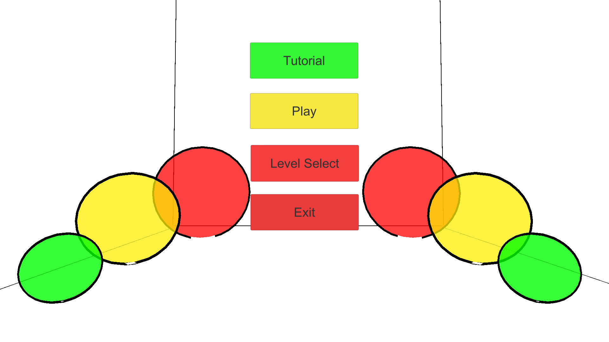
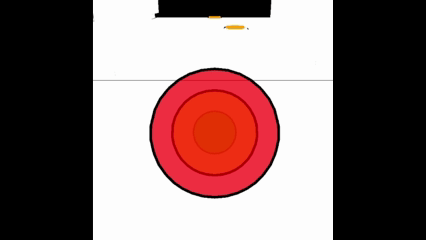
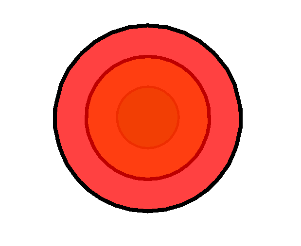
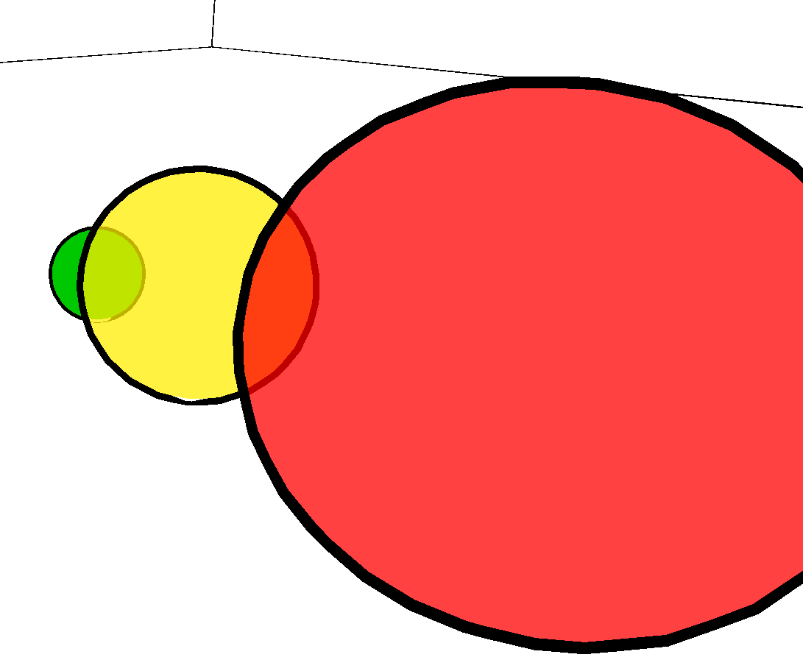

---
title: A Series of Blibs and Blobs
lead: 3 blobs, merging and splitting to solve a puzzle
published: 2020-01-01
tags: [ GamePortfolio, Unity, C#, .Net ]
---

A Series of Blibs and Blobs is a puzzle platformer where the player controls a set of three blobs that can merge with and separate from each other. Each blob has a special ability that helps the player solve puzzles.

Each has a different ability:
	- Red - The largest blob can pick up objects and move them where it sees fit.
	- Yellow - The middle blob can jump extremely high, allowing it to reach areas the other blobs cannot reach on their own.
	- Green - The smallest blob is very fast and, due to its size, can fit into places the other blobs cannot.

Because these blobs can act independently, they needed the ability to split and merge so you can control them individually.

Upon level completion, the blobs move to the next level by falling into the infinite abyss — there is a large hit collider beneath the entire level. This was done to make level transitions as seamless as possible without returning the player to a menu.

Visually, I experimented with shaders and aimed for an [Antichamber](https://store.steampowered.com/app/219890/Antichamber/) sort of look: very clean colours and strong outlines. This presented its own challenges, such as ensuring the player can see which blobs are currently active.

The shaders aren't very accessibility-friendly, but they served the prototype's needs.

Here is a rough gameplay walkthrough of the prototype where you can see some of the levels designed to test the concept.
