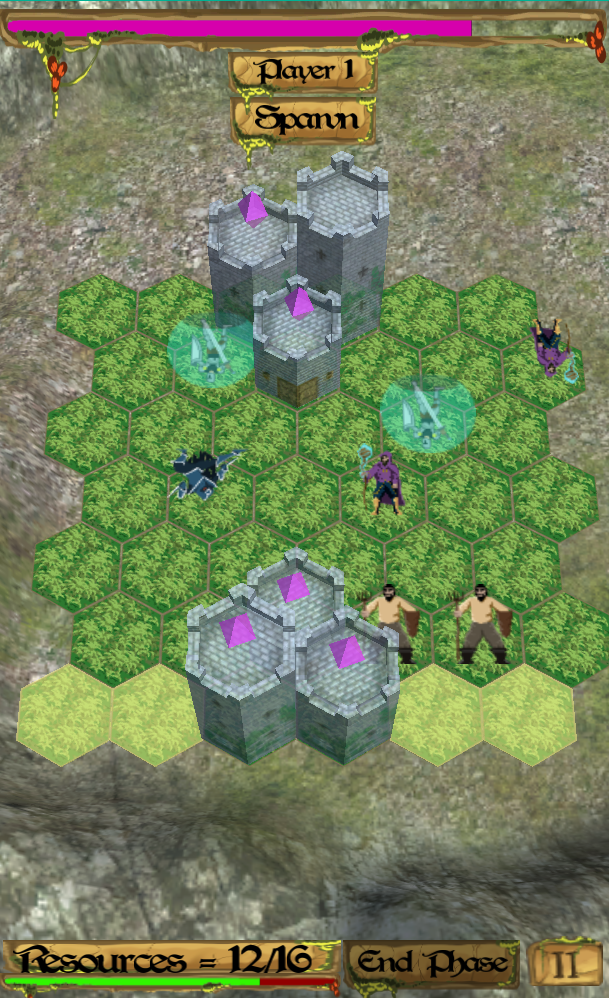
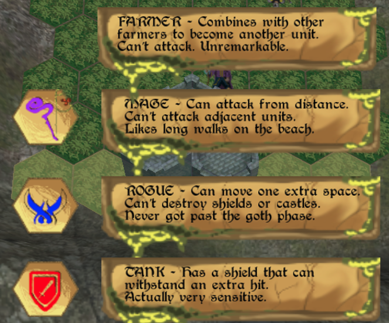
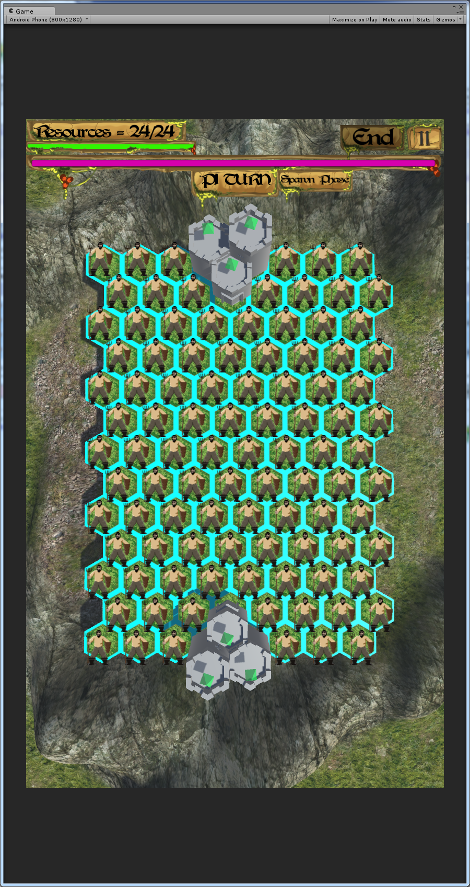

---
title: Castle Storm
lead: A two-player, tile-based clash of armies
published: 2016-05-06
tags: [ GamePortfolio, Unity, C#, .Net]
---

Castle Storm is a mobile two-player, hex-based strategy game where the main goal is to destroy your opponent's castle.

Each player takes turns, split into three phases: spawn units, move and combine them, and then attack.

The concept was to make it a mobile game so you and a friend could sit across from each other and play, rather than rely on online multiplayer.
Each turn the entire game board and UI would flip, so the upside-down knights near the topmost castle in the screenshot are actually enemy units.
Each unit type was unique and had strengths:
- Farmer — combines with other farmers to become another unit; unable to attack.
- Mage — can perform ranged attacks but not melee.
- Rogue — can move an additional space in a turn but cannot damage shields or castles.
- Tank — has a shield that allows it to absorb an additional hit before being destroyed.

Players always spawned farmers during the spawn phase, up to four per turn.

However, units were not without cost: players had to manage a resource bar that dictated how many units of each type they could have on the battlefield at once.
This mechanic was partly for balance, but it was also added to work around a bug that allowed a player to spawn an infinite number of farmers and fill the entire board. 

This was the project which got us (the team who worked on the game as a group project) into Brains Eden 2016, the 48 hour game jam where our theme was "Parity".

https://www.youtube.com/watch?v=8cNG5ZelTf0 Brains Eden 2016