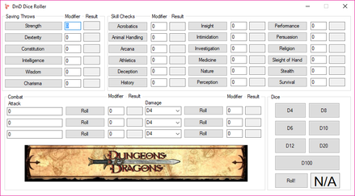
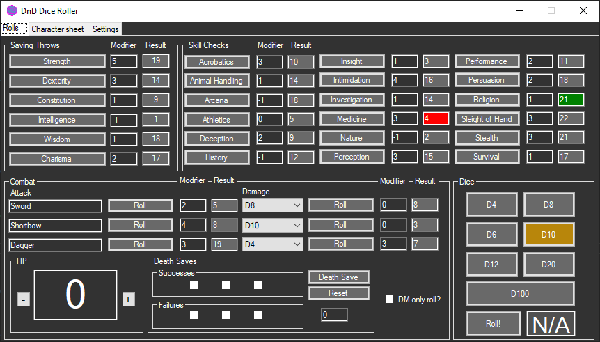
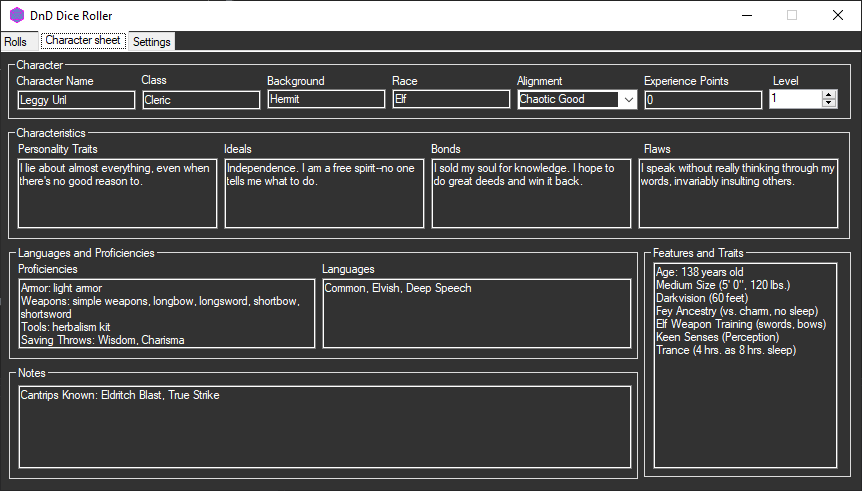
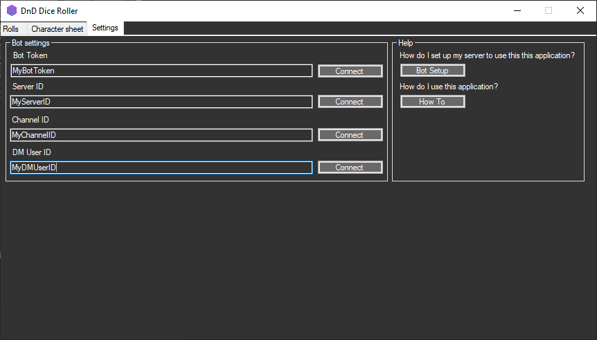

---
title: DnD Dice Roller
lead: Discord and Dragons and outdated UI
published: 2020-06-23
tags: [ Projects, .Net , C#, Windows Forms]
---

## How it started
During university, I played Dungeons and Dragons a pretty decent amount. Being surrounded by other, like-minded nerds, it wasn't hard to find a group to play consistently with and we did for quite a while. 
Once university was over though, and we were all scattered across the UK, playing in person was much more difficult. We were spending most nights chatting or playing games anyway so we decided to give it a try over Discord. 

We had tried using Roll20 but we found the only thing we really used it for was the `/roll` commands.
That's when the idea came to me, what if you could just press a button from a locally running application which will take all your modifiers etc into account and it gives you the number? 

## How it was made, what it used
Now I didn't know _jack_ about windows applications at the time. I was fresh out of university which had covered some of the basics so I just went "it's just for my small little friend group anyway, who cares how it looks"
Which is why when you see some screenshots, I ask you take the same approach 😉 

As the tags suggest, it was built using C# and Windows Forms:

It went through a couple of iterations, first thing which was added was of course, a dark mode to prevent you being flashbanged. 
But as we were using it naturally we'd be like "oh, it would be cool if it could do X" etc. 

Now the player characters were... a special bunch. They liked to do... strange things which resulted in a lot of laughs and some damaging consequences. 

## New and shiny

So the massive detail is that the large banner was removed and replaced with a working, death counter and combat section. 
This allowed players to input all of their modifiers etc so they can just press a single button and the app works it all out.

It also added some bits of polish, rolling a natural 1 (critical failure) would now highlight the number in red, with natural 20 (critical success) being green. 

It also added a couple of different pages. 
- A character sheet page 
- A settings page 

## Character page 

Not really too much to say on this, it's basically just a load of textboxes, it's only purpose is just to keep track of stuff which you would otherwise keep track of on your character sheet. 
The final page however...

## Discord integration
Discord integration, as someone fresh out of university was absolutely nuts to me. But I managed to make it so that pressing the button on a roll would also tell a bot to write the result in a Discord channel of the players choosing. 
It also had the option to make a "DM only roll" which would instead send your chosen DM a direct message, for those rolls you try and keep a little more conspicuous. (which for this group, was pickpocketing each other)

The Bot Setup and How To just redirected to web pages on my old (and now long gone) website. Way back machine has a version of it, but it's not exactly viewer friendly. (not at all, frankly)
Suppose I could pull out the html... But it'd likely be out of date anyway!

## Plans 
I did have other plans for it, which I might come back to one day, modernising the entire thing.

I wanted to: 
- Add a tab for any DM's tools
	- Allowing them to store stat blocks or take their own notes
	- Integration of some sort of music or video player which allows the DM to set the scene through the bot playing music in the voice channel
- Unique and random text which is output to Discord. 
	- Like having variations for messages of all kinds, leaning into the situation. Such as death throws taking into account how close you are to actually dying and such
- Fleshed out setup instructions, walking you through setup in-app instead of redirecting to a website

## Discontinuation
Through finishing the campaign and moving onto other passtimes, the project was eventually just never picked up again. I still have all the sourcecode, though!