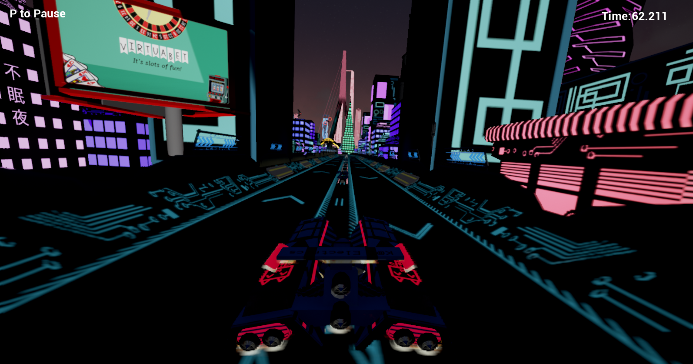

---
title: Luminocity
lead: A neon soaked joyride
published: 2016-05-06
tags: [ GamePortfolio, UnrealEngine, Blueprints ]
---

# Luminocity
Luminocity was a little bit different from previous projects, it was using a new engine (Unreal) and was the project which included the entire game development lifecycle.
It was also the first time that we had been working directly with the Game Art course meaning it tested our collaboration skills. (and is also why it looks _a lot_ better than the majority of the other games!)

We were told to produce a vertical slice of a racing style game. We decided to go down the futuristic approach, similar to the likes of Wipeout. 
We also decided on a futuristic sort of vibe, thinking lots of neon, big buildings, high FOV for a frantic, fast paced chaos drive.

Now I'm no artist, but I did do a couple of the billboards which can be seen in the game which are mostly just memes but done to look "corporate". (Like VirtuaBet, seen int he above screenie!)
Checkout the (low quality) track walkthrough! 
!

With it being a vertical slice, a lot of the things we wanted to have in the slice ended up being cut due to time restraints. 
Such as traffic, things flying overhead, multiple lanes for the track etc which made it feel a little empty, but it was good to go through the motions of game development, brainstorming a concept and then seeing and "pitching" the finished projects was ace.