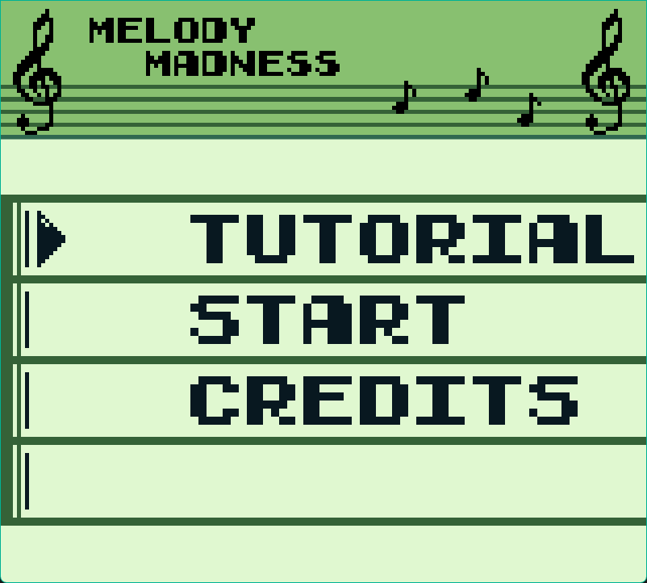
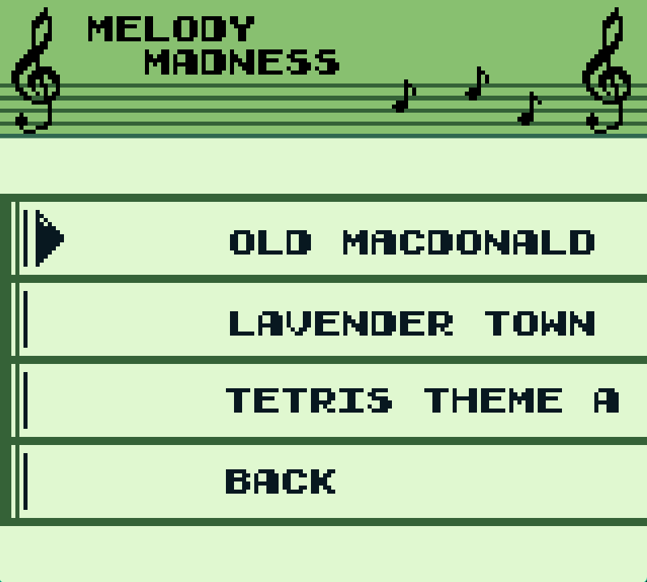
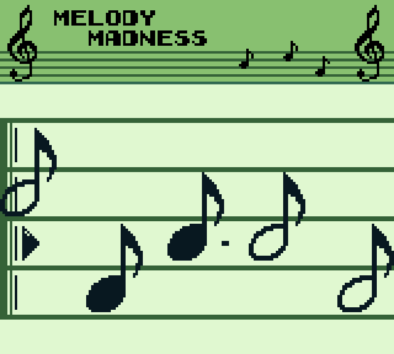

Melody Madness was developed (and not quite finished) in about six hours as part of the [GBJam 5](https://itch.io/jam/gbjam-5). 
The theme was to make a game reminiscent of something you might see on a Game Boy, so it used a fixed resolution of 160px × 144px and only four colours.

We, as a team of four, ended up making a Guitar Hero-style rhythm game which you can still download [here](https://maxtopan.itch.io/melody-madness)!

Pressing Start brings up a list of selectable songs.

After selecting a song, "uncoloured" notes appear at the right-hand side of the screen and slide to the left-hand side. 
The player's job is to shoot the notes so they become "coloured". When notes reach the left-hand side, if they are coloured they play a tone that varies by lane and note type; if not coloured, they do not play.

The goal of the game is to hit as many notes as possible. At the end you receive a percentage score representing the notes hit.

Modern hardware causes the game to run significantly faster than intended; Jupiter_Hadley kindly [played and uploaded](https://youtu.be/5WGdp-SnwXc?si=c0c2a1zIz-cLOdHL&t=157) her experience so you can see the intended pace.