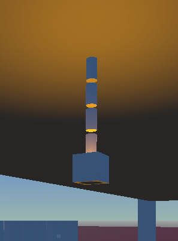
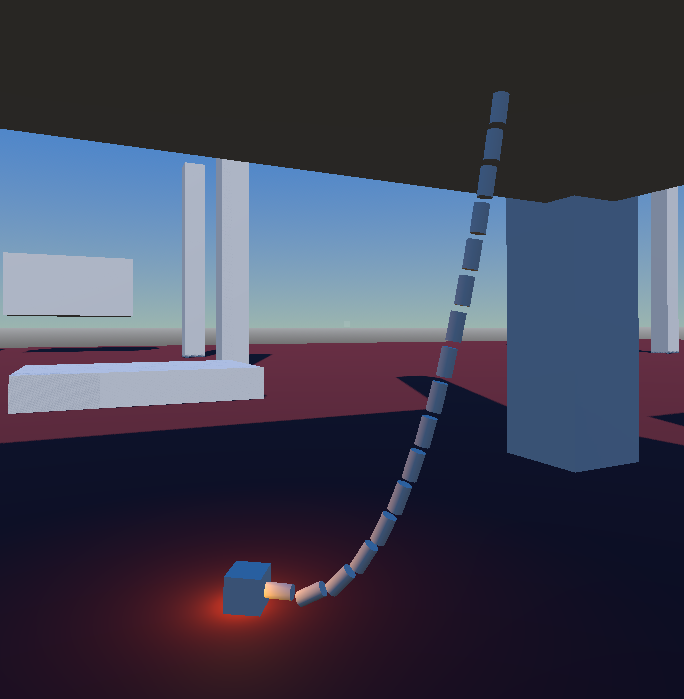
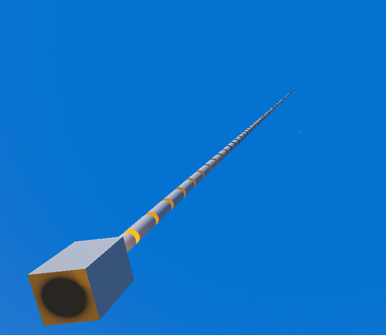

## Why Godot? 
Back in university I studied "Computer Gaming Technology" which, as a pretty enthusiastic gamer, seemed like a wicked way to make something I adored so much.
The course taught me how to program as well as how to make games using Unity. I used it for years making various projects (mostly unfinished prototypes). 
Unfortunately, Unity did an oopsy and tried to impose the infamous Runtime Fee.

They did backpedal after some, in my opinion, deserved backlash but it got me thinking.

Let's say I'd finished a project, shipped it etc. That would have impacted me massively as the developer. I didn't like that. I also wouldn't have had a say in it.
So I did some research and found out about Godot which, due to the Unity controversy, was getting a lot of backing and donations as an alternative so I decided to give it a try. 

## So what have you done in it? 
I've done a couple of small projects, most done not with the intention of actually shipping something but just adjusting to a new engine, new workflow etc.
This was mostly in the 2D space since I thought it'd be more straightforward. Last thing you need when learning a new engine is to bite off more than you can chew. 

After many hours messing about and learning the ropes I decided it's time to build something which I would enjoy playing.

Enter; The boomer shooter. 

## Boom, boom, boom 
I love first person shooters. Always have, I love the feeling you get when you do some sort of movement or flick and you're staring at your hand like "did _I_ do that?!?"

I look at things like Doom, Quake, ULTRAKILL and they FEEL fun to play. The core desire behind making any game I feel should be how fun it is. It should be enjoyable. 

So I'm taking that concept and I'm rolling with it completely, letting it drive every decision that I make when it comes to determining any features/mechanics. 
Before and after I implement something I'll be asking: "do I find this fun?" or "would this kill my enjoyment?" 

## Sch-moooovement 
As mentioned, movement is a big part of a boomer shooter. You gotta go fast and you gotta feel fast. 
Naturally, it's the first thing I started with when making this. 

I wanted movement that felt good, the first iteration is as simple as it comes. Moving forward, back, left and right. 
Making someone move in such a way is easy enough to do hook up the input, move in the corresponding direction and off you pop. 

But it lacks something. It feels static, like not enough feedback is given for the direction you're moving in. 
This is where I first started playing around with camera tilting. I started using tweening to animate a smooth transition from a "tilted" state to a non tilted state and it'll apply these when the character is moving. 

Straight away you can feel the difference, it's only a subtle tilt and this naturally introduces its own challenges since when I was developing this since initially I had a hitscan line beaming out of the characters face to be the shot so that had to change since it tilted with the camera. Not ideal. 

Only thing left is getting a decent jump. There is a jump mechanic which I have implemented but it's quite small at the moment. I'm imagining it'll just need to go a touch higher but want to spend time making sure it feels right rather than just going up.

## Barrel bonking
Now that the movement is in a pretty good place I decided to start just making a test level so that I could use it as my main "playground" for iterating on mechanics. After mucking about with the geometry more I realised that it was all feeling rather static. Which, of course it would, everything is completely static. 

So I decided to start mucking about with `RigidBody3D`, Godot's physics system. First thing I decided to try it on was a barrel. Nothing fancy, just the classic, waist high object which would go flying when it was hit (or be shot to explode). 

Next was the likes of lanterns. Might seem like a weird thing to go to next but it makes sense in the context of the theme. This was an interesting challenge because it had to be connected to something and still allow for physics when colliding with it. 

I decided to use chain links where there is a single, invisible object wherever I place the game object overall. This allows me in editor to place the "connection" point to the static object. At runtime, the script for the object will create the actual chain mechanism iteratively, so I'm able to decide how many links there are, how far apart they should be etc. 

It took probably much longer than it should have but I was really happy with the outcome of it overall.

Can have short bois: 

Can have long bois: 

Or _really really_ long bois: 

As you'd imagine, bumping into them will also cause them to go flying and return to their original position. (again, fitting the ever elusive theme 😉)

Check them out in engine here: 
